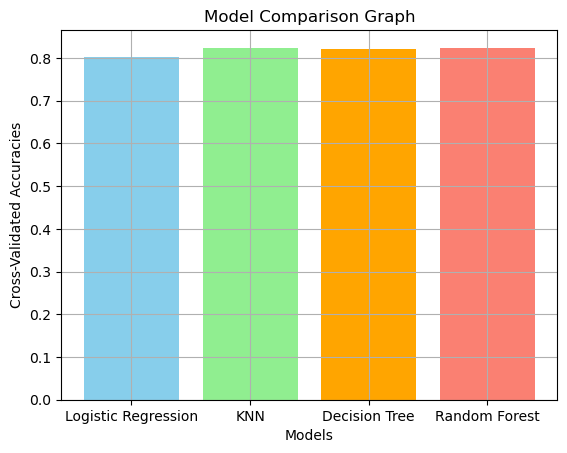

# Coursework Highlights
A collection of some work from university. Hope you find it interesting! 

## Here are some graphs I made for my Introduction to AI course: 

### Comparing Different Models




[Full Jupyter Notebook](IntroToAI/Titanic_Survival_PredHW4.ipynb)

##### Libraries Used

| Library      | Modules / Classes Used                                                                                                                                                   | Purpose                               |
| ------------ | ------------------------------------------------------------------------------------------------------------------------------------------------------------------------ | ------------------------------------- |
| `pandas`     | `pd`                                                                                                                                                                     | Data manipulation and analysis        |
| `numpy`      | `np`                                                                                                                                                                     | Numerical computing                   |
| `matplotlib` | `pyplot as plt`                                                                                                                                                          | Data visualization                    |
| `sklearn`    | `StandardScaler`, `train_test_split`, `KFold`,<br>`cross_val_score`, `LogisticRegression`,<br>`KNeighborsClassifier`, `DecisionTreeClassifier`, `RandomForestClassifier` | Machine learning models and utilities |

<br>
<br>

### Also some Search Algorithm stuff: 


[Full Jupyter Notebook](https://github.com/shp5238/CourseworkHighlights/blob/main/IntroToAI/search_algorithms%20-%20HA2.ipynb)

##### Libraries Used

| Library       | Modules / Classes Used | Purpose                             |
| ------------- | ---------------------- | ----------------------------------- |
| `heapq`       | —                      | Priority queue operations           |
| `collections` | `deque`                | Fast queue for search algorithms    |
| `math`        | —                      | Mathematical utilities              |
| `functions`   | `*`                    | Custom utility functions            |
| `maps`        | `*`                    | Custom map/grid data                |
| `matplotlib`  | `pyplot as plt`        | Visualization (inline with Jupyter) |


<br>
<br>
## Some Fun Snippets from Intro to Computer Systems:
<details>
  <summary>Show code</summary>
```c
int main(int argc, const char * argv[]){ 
    if (argc == 1){//uses standard input when no files in command line
        readFile(stdin);
        lines ++; //accounts for lack of new line in input for first line
        printf("%3d %6d (stdin)\n", sloc, lines);
    }else{ //reads the command line parameters
        for (int i = 1; i< argc; i++){ //loop through files
            sloc = 0; 
            lines = 0; //reset sloc and lines each loop
}
```
</details>

<br>
[From hw1.c](IntroComputerSys/hw1.c) 
<br> 
<details>
  <summary>Show code</summary>

```c
void write_data(Track* buffer, int count) {
    ...
    // Print the time
    printf(
        "reported: %hu/%.3s/%02hu %02hu:%02hu:%02hu\n",
        2000 + buffer[i].time_reported.year,
        months[buffer[i].time_reported.month],
        buffer[i].time_reported.day,
        buffer[i].time_reported.hour,
        buffer[i].time_reported.minute,
        buffer[i].time_reported.second
    );
}
```
</details> 

[From hw3.c](IntroComputerSys/hw3.c)

