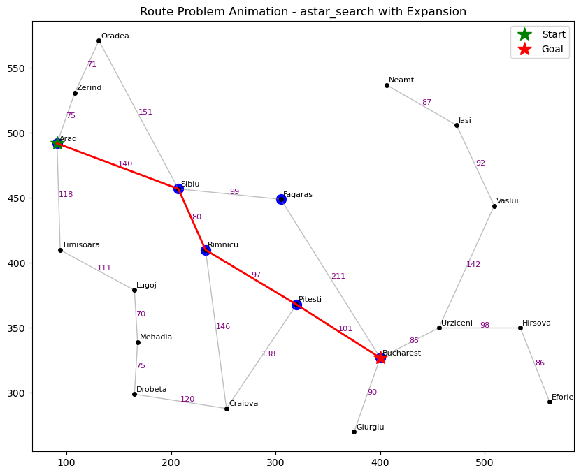

# Coursework Highlights
A collection of some work from university. Hope you find it interesting! 

## Here are some graphs I made for my Introduction to AI course: 

### Comparing Different Models


[Full Jupyter Notebook](IntroToAI/Titanic_Survival_PredHW4.ipynb)

##### Libraries Used

| Library      | Modules / Classes Used                                                                                                                                                   | Purpose                               |
| ------------ | ------------------------------------------------------------------------------------------------------------------------------------------------------------------------ | ------------------------------------- |
| `pandas`     | `pd`                                                                                                                                                                     | Data manipulation and analysis        |
| `numpy`      | `np`                                                                                                                                                                     | Numerical computing                   |
| `matplotlib` | `pyplot as plt`                                                                                                                                                          | Data visualization                    |
| `sklearn`    | `StandardScaler`, `train_test_split`, `KFold`,<br>`cross_val_score`, `LogisticRegression`,<br>`KNeighborsClassifier`, `DecisionTreeClassifier`, `RandomForestClassifier` | Machine learning models and utilities |

<br>
<br>

### Also some Search Algorithm stuff: 


[Full Jupyter Notebook](https://github.com/shp5238/CourseworkHighlights/blob/main/IntroToAI/search_algorithms%20-%20HA2.ipynb)

##### Libraries Used

| Library       | Modules / Classes Used | Purpose                             |
| ------------- | ---------------------- | ----------------------------------- |
| `heapq`       | —                      | Priority queue operations           |
| `collections` | `deque`                | Fast queue for search algorithms    |
| `math`        | —                      | Mathematical utilities              |
| `functions`   | `*`                    | Custom utility functions            |
| `maps`        | `*`                    | Custom map/grid data                |
| `matplotlib`  | `pyplot as plt`        | Visualization (inline with Jupyter) |


### Computer Vision here: 


[Full Jupyter Notebook](https://github.com/shp5238/CourseworkHighlights/blob/main/IntroToAI/COMP351_Computer_Vision_.ipynb)

##### Libraries Used

| Library      | Purpose                           |
| ------------ | --------------------------------- |
| `tensorflow` | Deep learning framework           |
| `keras`      | Neural network layers and models  |
| `numpy`      | Numerical operations              |
| `matplotlib` | Visualization of training results |


### Deep Learning here: 

[Full Jupyter Notebook](https://github.com/shp5238/CourseworkHighlights/blob/main/IntroToAI/COMP351_Deep_Learning.ipynb)

##### Libraries Used

| Library      | Purpose                              |
| ------------ | ------------------------------------ |
| `pandas`     | Data manipulation and analysis       |
| `numpy`      | Numerical operations                 |
| `matplotlib` | Data visualization                   |
| `sklearn`    | Data preprocessing, model evaluation |
| `tensorflow` | Deep learning framework              |
| `keras`      | High-level neural network API        |


<br>
<br>

## Some Fun Snippets from Intro to Computer Systems:

<details>
  
  <summary>Show full code</summary>
  
```c
int main(int argc, const char * argv[]){ 
    if (argc == 1){//uses standard input when no files in command line
        readFile(stdin);
        lines ++; //accounts for lack of new line in input for first line
        printf("%3d %6d (stdin)\n", sloc, lines);
    }else{ //reads the command line parameters
        for (int i = 1; i< argc; i++){ //loop through files
            sloc = 0; 
            lines = 0; //reset sloc and lines each loop

            FILE *fp = fopen(argv[i], "r"); //open file
            
            if (fp == NULL){ //error if file DNE 
                perror("Could not open file.\n");
                return 1; //indicate error
            }

            readFile(fp); //process file
            printf("%3d %6d %s\n", sloc, lines, argv[i]);
            fclose(fp); //close file
        }
    }
    
    if (argc > 2){ //if more than one file, print the totals
        printf("%3d %6d Total\n", totalSloc, totalLines);
    }
    return 0;
}
```
</details>

[From hw1.c](IntroComputerSys/hw1.c) 

<br> 
<details>
  <summary>Show full code</summary>

```c
void read_data(Track* buffer, int count, const char* file_name) {
    FILE* file = fopen(file_name, "rb");
    Track current;
    for (int i = 0; i < count; ++i) {
        fread(&current, sizeof(Track), 1, file);
        buffer[i] = current;
        memset(&current, 0, sizeof(Track));  // Clear for next read
    }
    fclose(file);
}
```
</details> 

[From hw3.c](IntroComputerSys/hw3.c)

